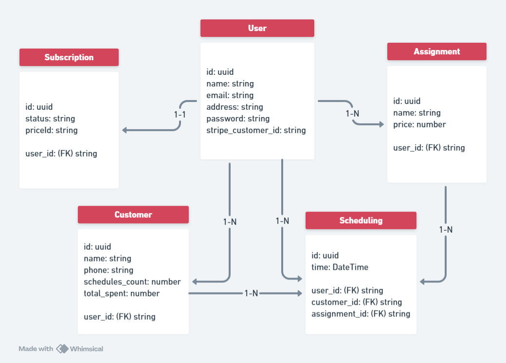

# **BeautyManager**

## 💡 **Sobre**
O BeautyManager é um sistema web no modelo SaaS (Software as a Service) desenvolvido para facilitar a gestão de salões de beleza, otimizando o controle de clientes, agendamentos e serviços. Oferece planos gratuito e premium para atender diferentes necessidades dos usuários e facilitar a organização do dia a dia do salão.

---

## 📖 **Índice**
1. [Links da aplicação](#🔗-links-da-aplicação)
2. [Destaques](#✅-destaques)  
3. [Tecnologias Utilizadas](#⚙️-tecnologias-utilizadas)
4. [Relação entre tabelas do banco](#⇅-relação-entre-tabelas-do-banco)
5. [Estrutura do Projeto](#📁-estrutura-do-projeto)   
6. [Como Executar o Projeto](#🚀-como-executar-o-projeto)
7. [Contribuição](#🤝-contribuição)  
8. [Licença](#📄-licença)  
9. [Contato](#📧-contato)  

---

## 🔗 Links da aplicação
- [Deploy back-end](https://beauty-manager-back-end.vercel.app/)
- [Deploy front-end](https://beauty-manager-front-end.vercel.app/)
- [Repositório do front-end](https://github.com/Antonio-Savio/BeautyManager-front-end)

---

## ✅ **Destaques**
- **Autenticação e autorização** utilizando token JWT.
- **CRUD** de agendamentos, clientes e serviços.
- Conexão com banco de dados relacional por meio de um **ORM moderno**, o Prisma, melhorando a produtividade.
- **Escalável**: A arquitetura do BeautyManager foi pensada para crescimento, com código modular, banco de dados eficiente e autenticação stateless - permitindo adicionar mais instâncias quando a base de usuários crescer.
- Conexão com **plataforma de pagamentos** para alternar assinatura (gratuito ou premium).
- Código **100% em TypeScript**, garantindo segurança de tipos e prevenção de erros em desenvolvimento.

---

## ⚙️ **Tecnologias Utilizadas**
- **Typescript**
- **Node.js**
- **Express**
- **PostgreSQL**
- **Prisma**
- **JWT para autenticação**  
- **Stripe**

---

## ⇅ **Relação entre tabelas do banco**


---

## 📁 **Estrutura do Projeto**
O projeto está organizado na seguinte estrutura:

```
/prisma
  ├── schema.prisma   # modelos do banco de dados
/src
  ├── @types/express/ # Extenção da tipagem do express para incluir o user_id
  ├── controllers/    # Controladores da aplicação
  ├── middlewares/    # Middleware para autenticação de rotas
  ├── prisma/         # Instancia o PrismaClient para se comunicar com o banco
  ├── services/       # Lógica de negócios
  ├── utils           # Funções utilitárias do stripe
  ├── routes.ts       # Definição das rotas
  └── server.ts       # Parte mais alta da aplicação para definição de middlewares globais
```

---

## 🚀 **Como Executar o Projeto**
### **Requisitos para Executar o Projeto**
- Node.js 
- NPM ou Yarn  
- Banco de Dados PostgreSQL
- Conta na Stripe configurada

---

### **Instalação e Configuração**
Siga os passos abaixo para rodar o projeto localmente:

```bash
# Clone o repositório
git clone https://github.com/Antonio-Savio/BeautyManager-back-end.git

# Acesse o diretório do projeto
cd BeautyManager

# Instale as dependências
npm install
```

### Configuração do Ambiente
Crie um arquivo `.env` e adicione as variáveis de ambiente necessárias, como:
```
DATABASE_URL=sua_string_de_conexao_postgresql
JWT_SECRET=sua_senha_JWT_secreta
NEXT_PUBLIC_STRIPE_PUBLIC_KEY=sua_chave_publica_Stripe
STRIPE_API_KEY=sua_chave_api_Stripe
STRIPE_PRICE=sua_chave_de_produto_Stripe
STRIPE_REDIRECT_URL=http://localhost:3000/dashboard/planos
STRIPE_WEBHOOK_SECRET=sua_chave_secreta_webhook
```

---

### **Execute em sua máquina**

```bash
yarn dev
# ou
npm run dev
```

---

## 🤝 **Contribuição**
Contribuições são bem-vindas! Siga os passos abaixo:
1. Faça um fork do projeto.
2. Crie uma branch para sua feature (`git checkout -b feature/nova-feature`).
3. Commit suas mudanças (`git commit -m 'Adiciona nova feature'`).
4. Push para a branch (`git push origin feature/nova-feature`).
5. Abra um Pull Request.

---

## 📄 **Licença**
Este projeto está sob a licença MIT. Consulte o arquivo [LICENSE](LICENSE) para mais detalhes.

---

## 📧 **Contato**
Se tiver dúvidas ou sugestões, entre em contato:
- **Email** - [savio.aragao@hotmail.com](mailto:savio.aragao@hotmail.com)
- **GitHub**: [Antonio-Savio](https://github.com/Antonio-Savio)
- **LinkedIn**: [antonio-savio](https://www.linkedin.com/in/antonio-savio)